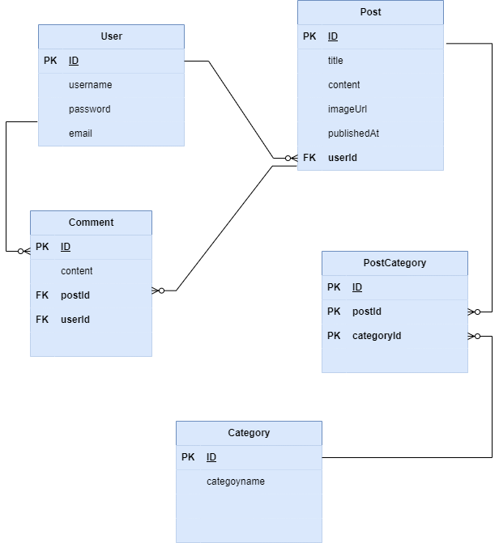

       
# Blogging System with Sequelize

## Introduction

This project aims to create a backend RESTful API for a sophisticated blogging system using Sequelize as the ORM to interact with a MySQL database. The system allows users to create posts, categorize them, and leave comments, with robust endpoints provided for managing users, posts, categories, and comments.

## General Description

This project is a backend RESTful API for a blogging system that utilizes Sequelize as the ORM to connect to a MySQL database. The schema is enhanced to include more complex associations, such as post categories and comments. Users can create posts, categorize them, and leave comments. The API provides endpoints for managing users, posts, categories, and comments.

## Technologies Covered and Prerequisites:

### Technologies:
- Node.js
- Express.js
- Sequelize (with MySQL database)

## Installation
To run the project locally, follow these steps:

1. clone the repository:
```
git clone https://github.com/Muna-Zeer/Muna-Zeer-Blogging.git
```
2. Install dependencies:
```
npm  install 
```

3. Build and run the project
```
npm run build
npm start
```
* This will build the JavaScript code and start the Express server.
## Suggested API Structure

### /api/users
- POST: Create a new user
- GET: Get all users
- GET /:userId: Get user by ID
- PUT /:userId: Update user by ID
- DELETE /:userId: Delete user by ID

### /api/posts
- POST: Create a new post
- GET: Get all posts with associated users, categories, and comments
- GET /:postId: Get post by ID with associated users, categories, and comments
- PUT /:postId: Update post by ID
- DELETE /:postId: Delete post by ID
- POST /:postId/categories: Create a new category for a post
- GET /:postId/categories: Get categories for a specific post
- POST /:postId/comments: Create a new comment for a post
- GET /:postId/comments: Get comments for a specific post

...
### ERD of the blogging system of the users




